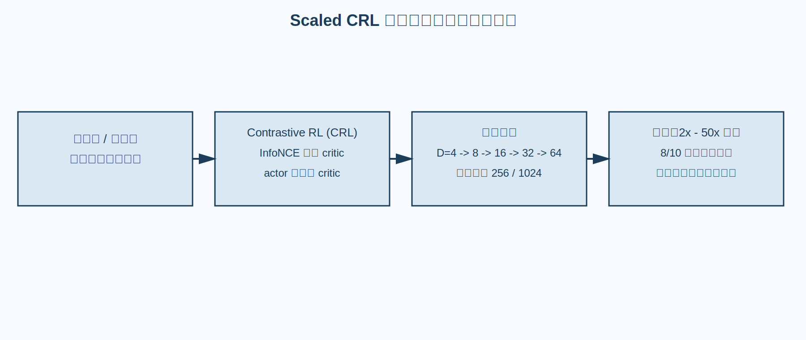
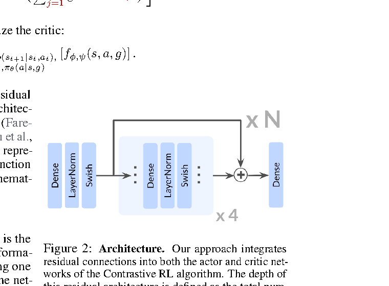
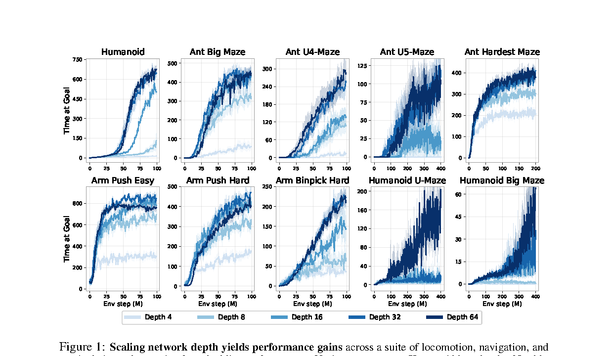
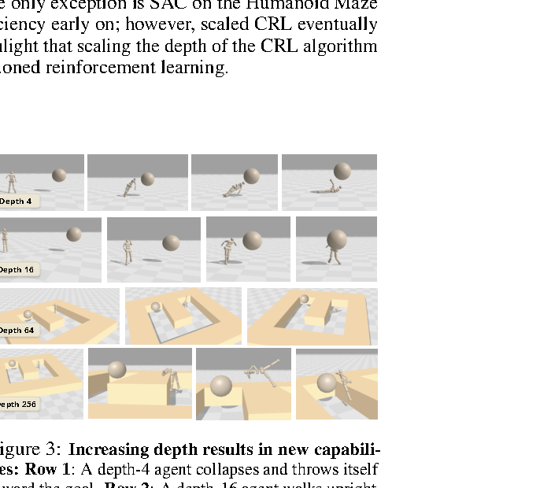
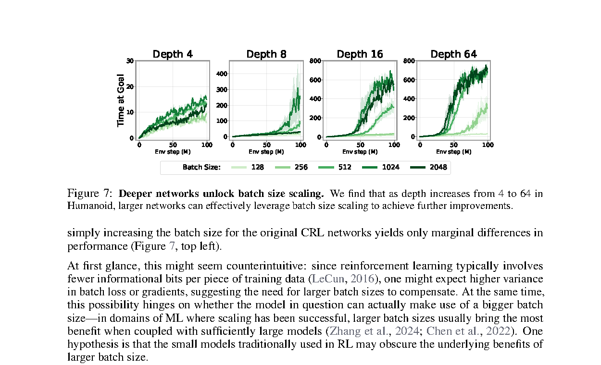
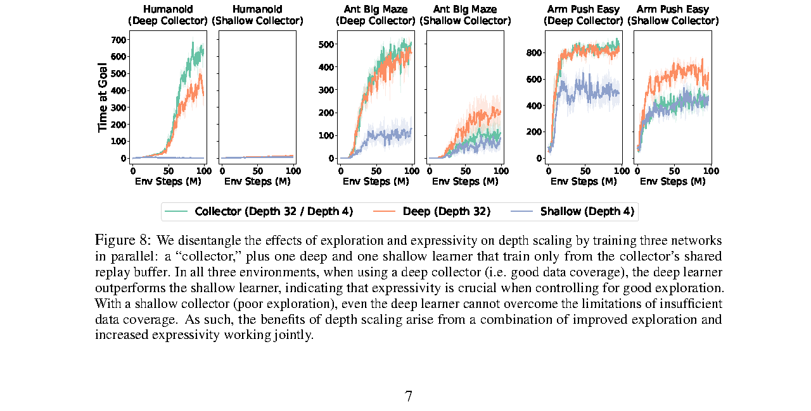

# 论文总结

## 基础信息
论文题目： 1000 Layer Networks for Self-Supervised Reinforcement Learning
作者： Yoni Kasten, Avinash Mandlekar, Danijar Hafner, Pieter Abbeel, Eric Jang
工作单位（optional)： UC Berkeley, Google DeepMind
发表时间： 2025-03-19（arXiv:2503.14858v1）
论文链接： https://arxiv.org/pdf/2503.14858

## 研究问题
### 要解决什么问题？
- 在无奖励、无示范的目标条件强化学习（goal-conditioned RL）中，现有方法通常使用浅层 MLP（约 2-4 层），性能和可扩展性都受限。
- 论文问题是：将 RL 网络深度从常见浅层扩展到极深（最高 1024 层）后，是否会出现可预测的 scaling law 与性能跃迁。

### 问题的数学描述
- 论文基于 Contrastive RL (CRL)，定义能量函数（文中式 (1)）：
$$
f_{\theta}(s,a,g)=\left\|\phi_{\theta}(s,a)-\psi_{\theta}(g)\right\|_2^2
$$
- 对应的 soft Q 函数（文中式 (2)）：
$$
Q_{\theta}(s,a,g)=\frac{\exp\left(-f_{\theta}(s,a,g)\right)}{\mathbb{E}_{g'\sim p(g)}\left[\exp\left(-f_{\theta}(s,a,g')\right)\right]}
$$
- critic 用 InfoNCE 目标（文中式 (3)）训练；actor 目标（文中式 (4)）为：
$$
\pi=\arg\max_{\pi}\;\mathbb{E}_{\tau\sim\pi}\left[\sum_{t=0}^{T}\gamma^t\,\mathbb{E}_{a\sim\pi(\cdot\mid s_t,g)}\left[Q_{\theta}(s_t,a,g)\right]\right]
$$

### 研究内容的关键假设
在哪些假设、限制条件下开展的研究。
- 使用简单 MLP（而非 Transformer）也能通过深度扩展获得显著性能提升。
- 结合 CRL 的 temporal difference 目标可以稳定训练极深网络。
- 训练任务为 sparse reward 的目标条件控制，且不使用 reward engineering 或 demonstrations。
- 推断：性能提升主要来自表示能力与优化动态改进，而非网络宽度变化。

### 为什么重要？
- RL 社区常默认“浅层 MLP 足够”，该工作系统性挑战了这一工程假设。
- 论文报告在多个高维控制环境上达到约 2x - 50x 的归一化分数提升，并在 10 个环境中有 8 个超过先前 SOTA。

## 技术方法
### 整个技术框架和原理（如适用）
- 基础算法：Contrastive RL（CRL），在目标条件 setting 下通过 InfoNCE 训练 value 表示，再用 actor 最大化对应 Q 值。
- 关键改动：保持算法与参数量对齐前提下，仅系统性增加网络深度（$D=4,8,16,32,64,\dots,1024$）。
- 网络实现：每层使用 `Linear(1024) + LayerNorm + ReLU`，并加入每 4 层一次的 skip-connection（论文 3.3 节）。
- 训练系统：异步并行数据收集与网络更新（Appendix D.2）。

### 流程图（必填）
图示 1（优先论文原图）：
- 图片：`./assets/2503.14858-1000-layer-self-supervised-rl-flow.svg`
- 若为 draw.io 自绘，源文件：`./assets/2503.14858-1000-layer-self-supervised-rl-flow.drawio`
- 图注：推断流程图。展示从无奖励探索、CRL 优化到深度扩展与性能提升的主链路。

图注：推断流程图，对应论文方法与实验主线（Section 3-4）。

### 算法框架图（必填）
图示 2（优先论文原图）：
- 图片：`./assets/2503.14858-fig2-arch.png`
- 图注：展示 `输入 -> 核心网络/模块 -> 输出`，包括状态、目标条件、critic 与 actor 分支。

图注：论文原图，来源 Figure 2（Section 3.3）。展示带 residual connections 的 CRL 架构模块，网络深度定义为 $4N$。

### 其它关键图示（按需但强烈建议）
图示 3+（按清晰度覆盖添加）：
- 论文实验关键图（原图截图）：

图注：论文原图，来源 Figure 1（Page 2）。展示不同网络深度在 10 个环境上的学习曲线。

图注：论文原图，来源 Figure 3（Page 5）。展示随深度增加出现的 qualitatively new behaviors。

图注：论文原图，来源 Figure 7（Page 7）。展示更深网络能更有效利用更大 batch size。

### 系统架构图说明
有几个神经网络，每个的输入输出、作用目的和信号更新频率。
- 共享 trunk（深度可扩展 MLP）：
- 输入：状态与动作相关表示（critic 路径）或状态条件表示（actor 路径）。
- 输出：中间特征供 critic / actor 头使用。
- critic 分支（$\phi,\psi$ 编码）：
- 输入：$(s,a)$ 与 $g$。
- 输出：能量函数与 soft Q 估计，用于 TD + InfoNCE 更新。
- actor 分支：
- 输入：$(s,g)$。
- 输出：动作分布 $\pi(a\mid s,g)$，通过最大化 Q 训练。
- 更新频率：异步环境交互与优化并行进行（论文实现细节）。

### 具体算法（针对每个具体神经网络）
- critic：使用 contrastive TD 目标学习目标条件价值函数。
- actor：最大化由 critic 给出的目标条件 Q 值。
- 深度扩展实验：在保持其余设置尽量不变时，仅改变层数观察 scaling 行为。

### 每个神经网络的架构
几层、如何构造、输入输出是什么。
- trunk 每层结构：`Linear(1024) -> LayerNorm -> ReLU`。
- 深度范围：从 4 层扩展到 1024 层（主文重点报告到 64 层，并展示更深趋势）。
- 残差连接：每 4 层一组 skip-connection。
- N/A：完整所有超参数组合（各环境完整网格）未在主文正文逐项列出（未在论文中明确给出）。

### 训练目的和 loss function
- critic 目标：InfoNCE + temporal difference bootstrap（CRL 核心）。
- actor 目标：最大化目标条件 soft Q（见式 (4)）。
- 论文讨论了极深网络下目标函数 landscape 与可优化性的变化（Section 4.3）。

### 如何获取训练数据
- 数据为在线交互轨迹：智能体在环境中自主探索并收集。
- 训练不使用 demonstrations，不依赖人工 reward shaping。
- 环境包含 D4RL-Maze2D, D4RL-AntMaze 与 Adroit 系列（door / pen / relocate / hammer）。

### 训练算法实践中的 insights 和 tricks
- 深度扩展时加入周期性 skip-connection 可稳定训练。
- 异步并行系统提高样本采集与学习吞吐，支持更大规模实验。
- 论文发现存在“临界深度”现象：约 32-64 层附近出现行为与性能跃迁。

## 实验结果
### 实验环境是什么，如何构建？
- 评测覆盖 10 个基准任务：Maze2D（3 个）、AntMaze（3 个）、Adroit（4 个）。
- 指标使用 D4RL 归一化分数（表 1）。
- 训练预算采用从 2M 到 4M environment steps 的统一对比设置。

### 对比的 baseline 算法有哪些？
- C-learning
- HIQL
- Contrastive RL（原始浅层配置）
- Scaled CRL（本文方法）

### 重要结果总结
在哪些方面有明显优势。
- 论文主结论不是“略优”，而是“深度扩展会系统性抬升上限”。
- 总体统计：Scaled CRL 在 10 个基准里 8 个达到最优，且平均分从约 50.6 提升到约 62.4（Table 1）。
- 难任务增益：`antmaze-umaze-diverse-v2` 从约 34.9 提升到 66.8，约 1.9x（Table 1）。
- 跨任务区间：摘要报告 2x - 50x 提升，说明提升不只集中在单个环境，而是跨任务出现（Abstract + Figure 2）。

关键数值（便于复用）：

| 指标 | 先前最佳 | Scaled CRL | 变化 |
|---|---:|---:|---:|
| 10 任务平均 D4RL 分数 | 50.6 | 62.4 | +11.8 |
| antmaze-umaze-diverse-v2 | 34.9 | 66.8 | +31.9（约 1.9x） |
| SOTA 覆盖任务数 | N/A | 8 / 10 | N/A |

从图中应读出的信息（不是只看“谁最高”）：
- 主结果图（Figure 1）显示 Scaled CRL 在多数任务学习曲线更高，优势并非单点偶然。
- 深度相关图（Figure 3, Figure 7）显示性能随深度先缓慢提升，在约 32-64 层附近出现明显跃迁（critical depth）。
- 该“临界深度”现象支持论文核心论点：在 self-supervised RL 里，深度本身是关键可扩展维度，而不是仅靠更复杂算法技巧。

图注：论文原图，来源 Figure 1（Page 2）。

图注：论文原图，来源 Figure 8（Page 7）。展示深层/浅层与 deep/shallow collector 的差异。

## 总结
### 文章最主要的 idea 是什么？
- 在 self-supervised goal-conditioned RL 中，单纯扩大 MLP 深度（而非改复杂架构）就能系统性提升性能，并呈现可解释的 scaling 行为。

### 最大的亮点是什么？
- 证明了“超深 MLP 在 RL 中可训练且有效”，并观察到从渐进改进到突变式提升的临界深度现象。

### 重要拓展方向？
- 将深度 scaling 规律迁移到视觉输入和真实机器人 control。
- 研究深度与宽度、数据规模、并行系统之间的联合 scaling law。
- 探索超深 RL 网络的稳定性理论与泛化理论。

### 其它 critiques
- 当前实验主要是低维状态输入，向高维视觉任务迁移仍需更多验证。
- 训练成本与系统复杂度随深度显著上升。
- 推断：不同任务是否存在统一“临界深度”，还需要更大范围实证。
