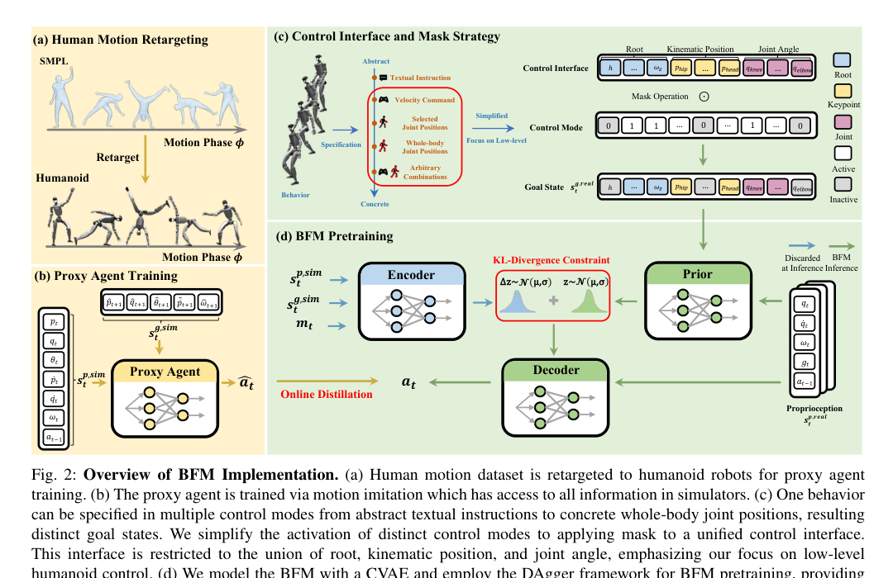
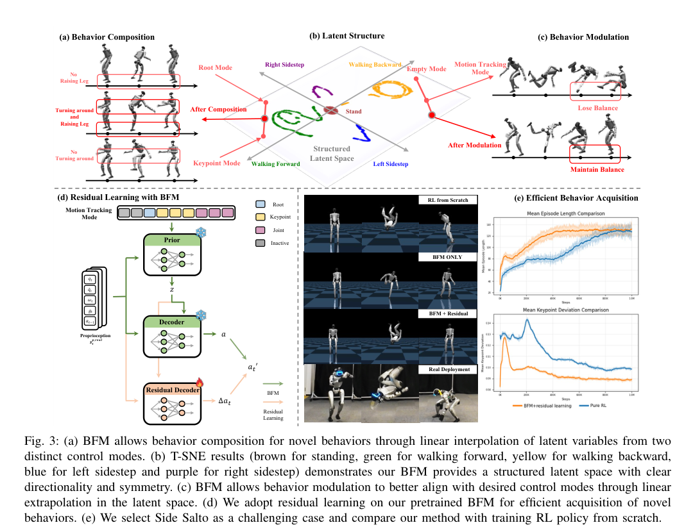
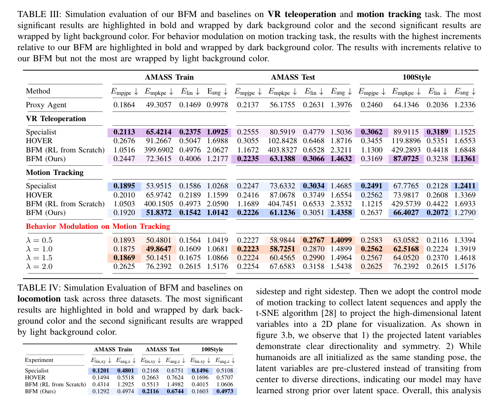

# 论文总结

## 基础信息
论文题目：Behavior Foundation Model for Humanoid Robots
作者：Weishuai Zeng, Shunlin Lu, Kangning Yin, Xiaojie Niu, Minyue Dai, Jingbo Wang, Jiangmiao Pang
工作单位（optional)：Peking University, The Chinese University of Hong Kong, Shenzhen, Shanghai Jiao Tong University, Fudan University, Shanghai Artificial Intelligence Laboratory
发表时间：2025 年（arXiv v1）
论文链接：https://arxiv.org/abs/2509.13780

## 研究问题
### 要解决什么问题？
- 现有 humanoid whole-body control (WBC) 往往按任务定制（locomotion, teleoperation, motion tracking），控制模式固定，跨任务泛化弱。
- 奖励函数工程成本高，新增行为通常要重新训练策略。
- 论文目标：学习一个可被任意控制模式驱动的行为基础模型，使其在多任务上零样本可用，并能高效扩展新行为。

### 问题的数学描述
- 论文将控制问题写成 goal-conditioned RL：
  - 状态：$s_t=(s_t^p,s_t^g)$，其中 $s_t^p$ 为本体状态，$s_t^g$ 为目标状态。
  - 奖励：$r_t=R(s_t^p,s_t^g)$。
  - 动作：$a_t$ 为关节目标，由 PD controller 执行。
  - 优化目标：$\mathbb{E}[\sum_{t=1}^{T}\gamma^{t-1}r_t]$。
- BFM 预训练采用 CVAE + online distillation：
  - 蒸馏损失：$L_{\text{DAgger}}=\|\hat{a}_t-a_t\|_2^2$。
  - 总损失：$L=L_{\text{DAgger}}+\lambda_{KL}L_{KL}$。

### 研究内容的关键假设
在哪些假设、限制条件下开展的研究。
- 控制接口聚焦低层控制变量（root, keypoint/kinematic, joint），高层语义（例如 language）通过映射到该接口后再控制。
- 训练依赖模拟器与 proxy agent（IsaacGym 8192 并行环境），再用蒸馏迁移到真实可观测状态。
- 推断：模型效果依赖“行为数据覆盖度”，当新行为分布与预训练分布偏差较大时，仍需要 residual learning。

### 为什么重要？
- 将“按任务训练 policy”转为“统一行为建模”，减少重复训练。
- 对真实 humanoid 部署更实用：同一模型可切换多控制模式，并支持新行为快速获取。

## 技术方法
### 整个技术框架和原理
- 针对问题：多任务 WBC 的控制模式割裂与泛化不足。
- 采用的方法：
  - 阶段 1：用 AMASS 动作重定向 + motion imitation 训练 proxy agent。
  - 阶段 2：用 masked online distillation 训练 BFM（CVAE 结构）。
  - 阶段 3：对新行为冻结 BFM 主体，训练 residual decoder 加速适配。
- 为什么有效：
  - 统一控制接口 + mask 让不同任务共享同一行为生成器。
  - CVAE latent space 支持行为插值/外推（composition/modulation）。
  - proxy agent 提供稳定 teacher 信号，降低直接从 scratch 学习难度。
- 如 Figure 2 所示（PDF Page 3），系统包含 `输入 -> 核心模块 -> 输出`：
  - 输入：$s_t^{p,real}$ 与掩码后的目标接口 $s_t^{g,real}$。
  - 核心模块：Prior / Encoder / Decoder（CVAE）+ DAgger 蒸馏。
  - 输出：动作 $a_t$（关节目标）。
  - 关键信号：mask $m_t$ 控制不同模式激活；teacher action $\hat{a}_t$ 用于蒸馏。

### 具体算法（针对每个具体神经网络）
- Proxy Agent（teacher policy）
  - 架构：N/A，未在论文中明确给出（层数/hidden size 未披露）。
  - 输入输出：输入 privileged state + goal state，输出动作 $\hat{a}_t$。
  - 训练目标：PPO 最大化累计奖励。
  - 数据来源：AMASS 重定向后的 humanoid 动作序列。
  - tricks：课程学习、domain randomization、hard negative mining。
- BFM (CVAE)
  - 架构：Prior/Encoder/Decoder 均建模为 Gaussian；Decoder 固定方差；Encoder 设计为对 Prior 的 residual。
  - 输入输出：
    - Encoder 输入包含 $(a_t, s_t^{p,real}, s_t^{g,real}, m_t)$。
    - Decoder 用 $(s_t^{p,real}, z)$ 预测动作 $a_t$（论文刻意不将 $s_t^{g,real}$ 输入 Decoder 以增强 latent 承载能力）。
  - 训练目标：$L=L_{\text{DAgger}}+\lambda_{KL}L_{KL}$。
  - 数据来源：DAgger 在线 rollout 轨迹 + proxy action 标注。
  - tricks：Bernoulli mask（从 1.0 冷启动退火到 0.5）支持 arbitrary control modes。
- Residual Decoder（新行为获取）
  - 输入输出：学习 $\pi(\Delta a_t\mid s_t^{p,real},z)$，最终动作 $a_t'=a_t+\Delta a_t$。
  - 训练目的：在冻结 BFM 情况下快速学习 OOD 新行为。

## 实验结果
### 实验环境是什么，如何构建？
- 训练平台：IsaacGym，8192 并行环境。
- 评估：sim-to-sim（Mujoco）+ sim-to-real（Unitree G1）。
- 实机设置：G1 高 1.3 m，29 DoF；冻结双腕后控制 23 DoF。

### 对比的 baseline 算法有哪些？
- 通用基线：HOVER。
- 任务专用基线：
  - motion tracking：GMT 实现风格。
  - VR teleoperation：OmniH2O 实现风格。
  - locomotion：作者自实现 specialist。
- 消融：BFM (RL from scratch)、Proxy Agent。

### 重要结果总结
- 论文原图证据（实验图）：Figure 3（PDF Page 7）展示 latent structure、行为组合、行为调制与 residual learning 收敛优势。

- 论文原图证据（主结果表）：Table III/IV（PDF Page 6）给出三数据集、三任务定量指标。

- 关键数字（从 Table III/IV 提炼，越低越好）：

| 任务与数据集 | 指标 | HOVER | BFM (Ours) | 相对变化 |
|---|---:|---:|---:|---:|
| VR teleoperation, AMASS Test | $E_{\text{mpkpe}}$ | 102.8428 | 63.1388 | -38.61% |
| Motion tracking, AMASS Test | $E_{\text{mpkpe}}$ | 87.0678 | 61.1236 | -29.80% |
| Locomotion, AMASS Test | $E_{\text{lin,xy}}$ | 0.2663 | 0.2116 | -20.54% |
| Locomotion, AMASS Test | $E_{\text{ang,z}}$ | 0.7624 | 0.6744 | -11.54% |

- 图表说明了什么：
  - Figure 3(b)：latent space 在不同行为方向上呈结构化分布，支持可控插值与外推。
  - Figure 3(a)(c)：同一 BFM 可通过 latent 操作完成行为组合与调制。
  - Figure 3(e)：在 Side Salto 等新行为上，residual learning 比 pure RL from scratch 更快收敛、误差更低。
  - Table III/IV：BFM 在多数指标上优于 HOVER，且显著优于 BFM from scratch。

## 总结
### 文章最主要的 idea 是什么？
- 用“行为建模”统一多种 humanoid 控制任务：先训练 proxy agent，再用 masked distillation + CVAE 预训练 BFM，最后以 residual learning 快速扩展新行为。

### 最大的亮点是什么？
- 在一个统一模型中同时实现：跨任务控制、latent 可解释性（组合/调制）、以及新行为高效获取。

### 重要拓展方向？
- 扩展当前低层控制接口，纳入更高层语义控制（例如语言/任务规划）。
- 引入更大规模真实世界行为数据，减少 sim bias。
- 探索更强的时序建模（N/A，未在论文中明确给出当前网络深层时序模块）。

### 其它 critiques
- 网络结构细节（层数、维度、频率等）披露不足，复现门槛较高。
- 方法高度依赖 proxy 数据质量与控制接口设计，若接口不完备可能限制泛化上限。
- 推断：对极端动态行为，仍可能需要任务定制的 residual 微调。
