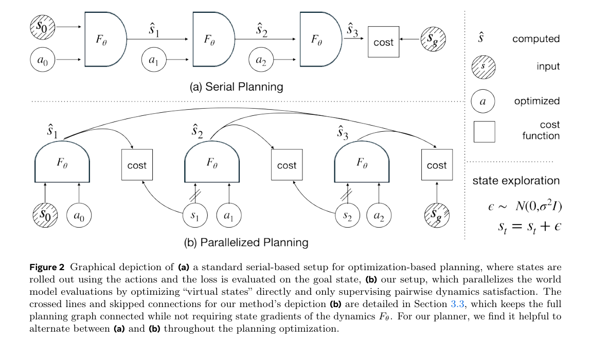
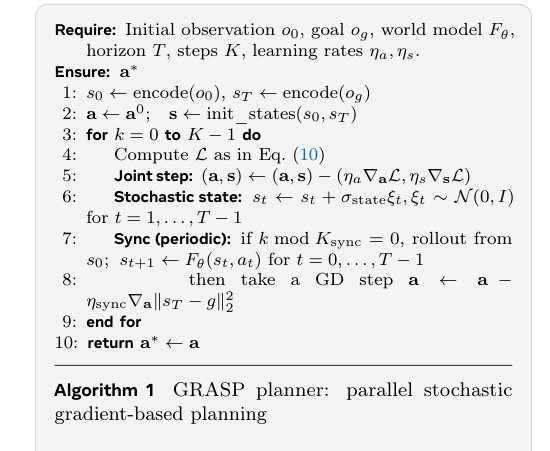
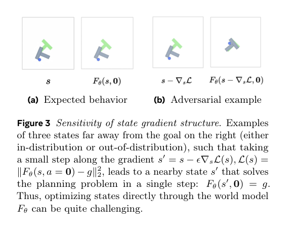
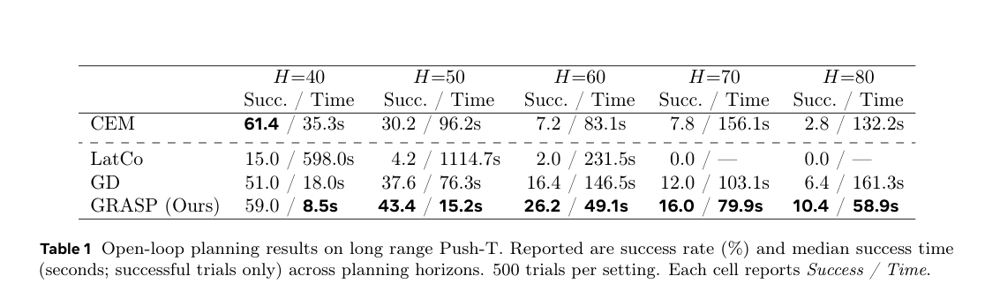
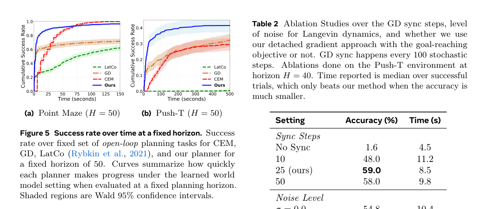
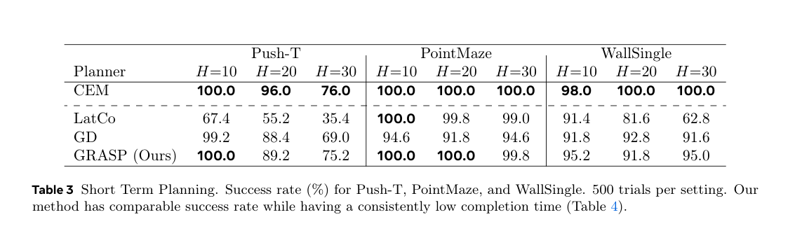
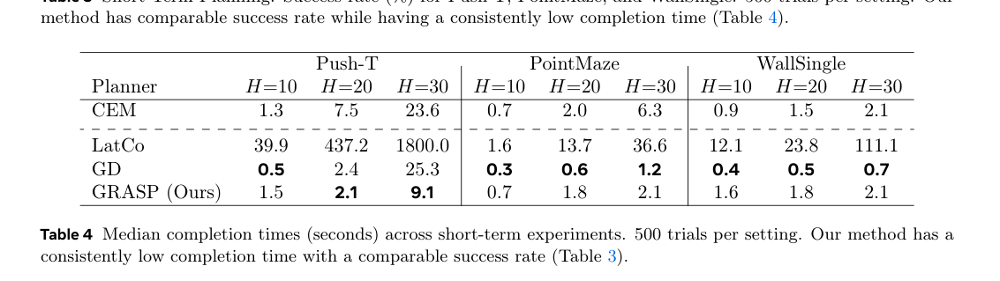

# 论文总结

## 基础信息
论文题目：
Parallel Stochastic Gradient-Based Planning for World Models

作者：
Michael Psenka, Michael Rabbat, Aditi Krishnapriyan, Yann LeCun, Amir Bar

工作单位（optional)：
University of California, Berkeley; Meta FAIR; New York University

发表时间：
2026-02-03（论文首页日期）

论文链接：
https://arxiv.org/pdf/2602.00475

## 研究问题
### 要解决什么问题？
- 论文聚焦视觉 world model 下的长时域规划：给定初始状态与目标状态，求动作序列使终点到达目标。
- 传统串行 rollout 优化在长 horizon 下常出现两类失败：
- 梯度条件变差，导致优化效率和稳定性下降。
- 易陷入局部最优，出现“短视”的贪心轨迹。

### 问题的数学描述
- 标准规划目标：
$$
a^* = \arg\min_a \|F_\theta^T(a, s_0) - g\|_2^2
$$
- 论文改写为 lifted 联合优化（把中间状态当作优化变量）：
$$
\min_{s,a} \sum_{t=0}^{T-1} \|F_\theta(s_t, a_t)-s_{t+1}\|_2^2,\quad s_0\ \text{fixed},\ s_T=g
$$
- 为处理状态梯度脆弱性，最终使用 stop-gradient + dense goal shaping：
$$
\mathcal{L}(s,a)=\sum_{t=0}^{T-1}\|F_\theta(\bar{s}_t,a_t)-s_{t+1}\|_2^2+\gamma\sum_{t=0}^{T-1}\|F_\theta(\bar{s}_t,a_t)-g\|_2^2
$$

### 研究内容的关键假设
在哪些假设、限制条件下开展的研究。
- 假设有可微分 world model $F_\theta$，并可把观测编码到状态空间。
- 主要评估 open-loop planning，不依赖每一步真实环境反馈修正。
- 重点改 planner，不改 world model 训练过程。

### 为什么重要？
- 长时域规划是 model-based 控制能否落地的关键瓶颈。
- 若 planner 在成功率与耗时上都优于 CEM/GD，可直接提升 world model 的工程可用性。

## 技术方法
### 整个技术框架和原理
- 针对“串行 rollout 难优化、长时域易局部最优”这个问题，GRASP 的解法是：把中间状态从“被动 rollout 结果”改成“主动可优化变量”，形成并行优化图。
- 如 Figure 2 (Page 3) 所示，左图是传统串行链式计算，右图是 GRASP 的并行虚拟状态优化；这一步本质上把时间耦合弱化，换来更好的并行性与优化自由度。

- 系统层面并没有新增多个神经网络，核心仍是 1 个世界模型 $F_\theta$：输入 $(s_t,a_t)$，输出 $s_{t+1}$。GRASP 本身是规划优化器，不是新网络。
- 信号更新频率：
- 每轮优化都更新动作序列 $a$。
- 每轮优化都更新中间状态 $s$，并对状态注入高斯噪声。
- 每隔 $K_{sync}$ 轮做一次 full-rollout sync，用原始 rollout loss 对动作做少量精修。
- 为什么这样有效：并行虚拟状态提供探索空间，状态噪声帮助跳出坏盆地，周期 sync 防止轨迹长期漂离可执行解。

### 具体算法（针对每个具体神经网络）
- 每个神经网络的架构：
- 主文未展开 DINO-wm 的层数与内部构造。
- N/A：未在论文主文中明确给出“每层结构/层数”。
- 可确定的 I/O：世界模型输入状态和动作，输出下一状态。

- 训练目的和 loss function：
- 这里的“训练”是 test-time planning 优化，不是重新训练 $F_\theta$。
- 目标函数由两部分组成：
- 动力学一致性项，约束虚拟状态满足模型一步转移。
- 稠密目标项，把每一步一步预测都拉向目标 $g$，避免只在终点才有监督信号。
- 如 Algorithm 1 与 Eq. (8-12) (Page 5) 所示，优化流程是“联合更新 $(s,a)$ -> 状态加噪 -> 周期 sync”。

- 如何获取训练数据：
- 世界模型训练数据来自 PointMaze、WallSingle、Push-T 的视觉轨迹（沿用 DINO-wm 设置）。
- N/A：具体数据采集流程、总样本量、采样分布在主文未详细给出。

- 训练算法实践中的 insights 和 tricks：
- 只对状态加噪，不对动作加噪，有助于更快探索关键中间状态。
- stop-gradient on state input 是关键稳健化措施。
- 如 Figure 3 (Page 4) 所示，若直接利用状态输入梯度，优化可能走向“对抗式捷径”而非物理可行轨迹，因此论文切断该路径，只保留动作梯度。

## 实验结果
### 实验环境是什么，如何构建？
- 环境：PointMaze、WallSingle、Push-T。
- 模型：使用 DINO-wm 训练好的 world model。
- 指标：成功率与成功样本中位规划时间。
- 规模：每个设置 500 trials。

### 对比的 baseline 算法有哪些？
- CEM
- LatCo
- GD
- GRASP（本文）

### 重要结果总结
在哪些方面有明显优势。
- 如 Table 1 (Page 7) 所示，长时域 Push-T 下 GRASP 在多个 horizon 同时取得更高成功率和更低时间。

- 如 Figure 5 (Page 7) 所示，在固定 H=50 下 GRASP 的累计成功率曲线更早上升，说明它更快找到可行解。

- 短时域结果显示 GRASP 没有显著退化：Table 3 (Page 8) 成功率总体与强基线接近，Table 4 (Page 8) 耗时保持较低。

- 关键数值（Push-T, Table 1）：

| Horizon | CEM 成功率 / 时间 | GD 成功率 / 时间 | GRASP 成功率 / 时间 | GRASP vs GD | GRASP vs CEM |
|---|---|---|---|---|---|
| H=50 | 30.2% / 96.2s | 37.6% / 76.3s | 43.4% / 15.2s | +5.8 pct | -81.0s |
| H=60 | 7.2% / 83.1s | 16.4% / 146.5s | 26.2% / 49.1s | +9.8 pct | -34.0s |
| H=80 | 2.8% / 132.2s | 6.4% / 161.3s | 10.4% / 58.9s | +4.0 pct | -73.3s |

- 消融结论（Push-T, H=40, Table 2）：
- 无 sync 时成功率降到 1.6%。
- 不做状态梯度截断（Flow）降到 46.6%，且更慢（10.3s vs 8.5s）。
- 噪声过低或过高都比默认 $\sigma=0.5$ 更差。

## 总结
### 文章最主要的 idea 是什么？
- 用“并行虚拟状态优化 + 状态噪声探索 + 状态梯度截断 + 周期 sync”替代纯串行 rollout 优化，专门解决长时域视觉规划的稳定性与效率问题。

### 最大的亮点是什么？
- 不改 world model 训练，仅通过 planner 设计就在长时域取得更高成功率和更短时间。

### 重要拓展方向？
- 从 open-loop 走向闭环 MPC 验证真实执行鲁棒性。
- 与 uncertainty-aware world model 结合，进一步提升超长时域稳定性。

### 其它 critiques
- 主文对世界模型内部网络细节披露有限，复现要依赖外部实现。
- 评测主要在 learned model 内完成，真实环境偏差下的效果仍需更多实证。
