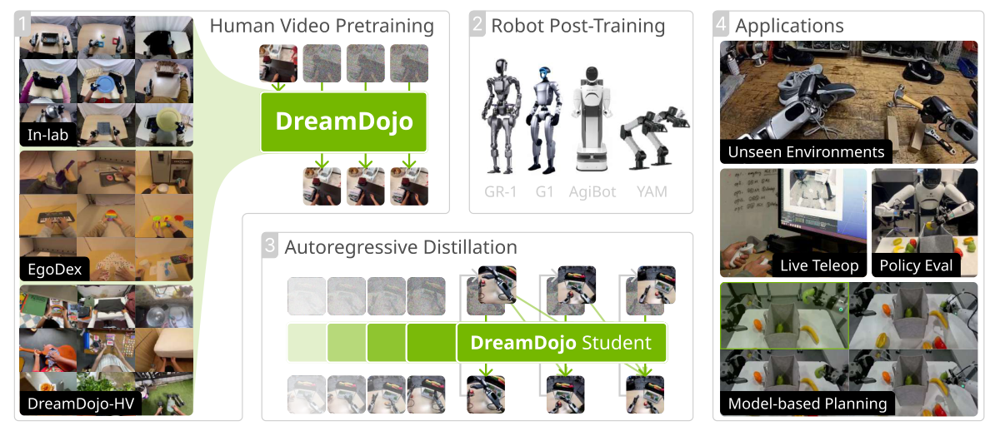
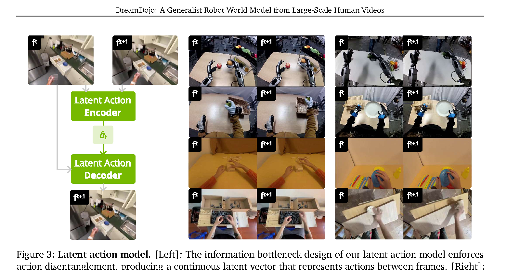
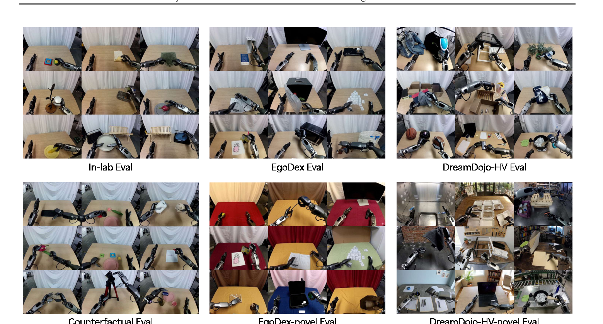
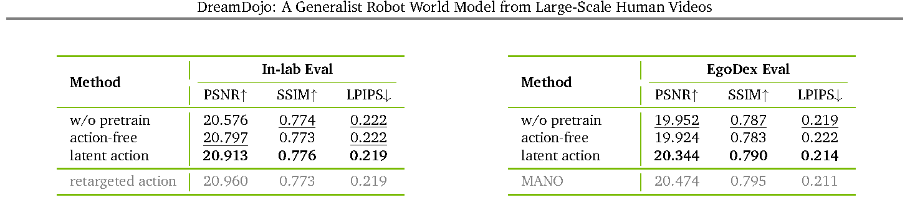
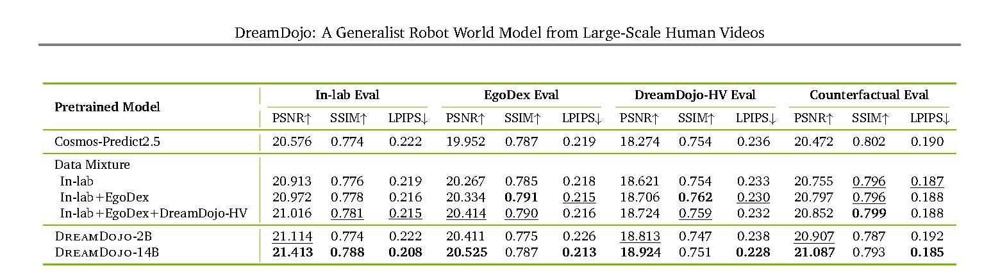
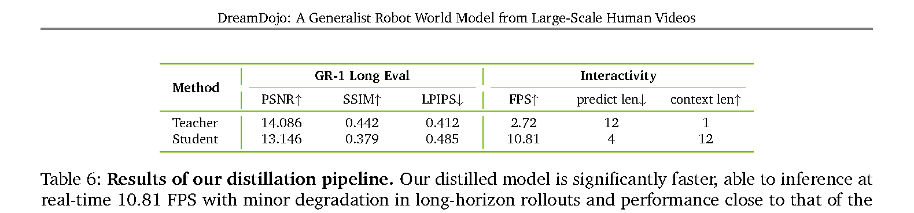
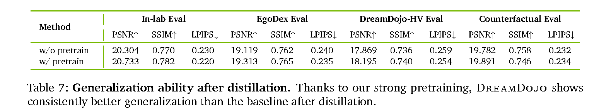
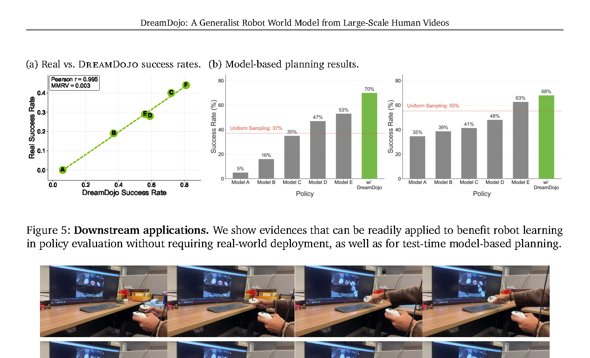

# 论文总结

## 基础信息
论文题目：DreamDojo: A Generalist Robot World Model from Large-Scale Human Videos
作者：Shenyuan Gao, William Liang, Kaiyuan Zheng, Ayaan Malik, Seonghyeon Ye, et al.
工作单位（可选）：NVIDIA, HKUST, UC Berkeley, UW, Stanford, KAIST, University of Toronto, UCSD, UT Austin
发表时间：2026 年（arXiv v1: 2026-02-06）
论文链接：https://arxiv.org/abs/2602.06949

## 研究问题
### 要解决什么问题？
- 目标是训练可交互的机器人 world model：给定当前观测与动作，预测未来视频状态，并在未见场景/物体/动作下保持可控。
- 核心矛盾：
  - 机器人真机数据昂贵且覆盖窄，难支撑开放世界泛化。
  - 大规模人类视频很多但缺少动作标签，难直接用于 action-conditioned world model。

### 问题的数学描述
- 交互式 world model 的目标可写为：$s_{t+1} \sim p(\cdot \mid s_t, a_t)$。
- 基座视频模型采用 flow matching 目标：$\mathcal{L}_{flow}(\theta)=\mathbb{E}\|u(x_\tau,\tau,c;\theta)-v_\tau\|^2$。
- DreamDojo 在此基础上加入时间一致性项：$\mathcal{L}_{final}=\mathcal{L}_{flow}+\lambda\mathcal{L}_{temporal}$，文中取 $\lambda=0.1$。

### 研究内容的关键假设
- 假设人类第一视角视频与机器人交互共享可迁移的物理规律。
- 假设连续 latent action 能作为跨数据源统一动作代理，缓解“视频有画面但无动作标签”的监督缺口。
- 假设少量目标机器人后训练可把预训练的物理知识对齐到目标动作空间。
- 局限：论文明确提到极快动作（如快速挥动）和部分极端场景仍不稳定；多视角 world model 也未覆盖。

### 为什么重要？
- 如果 world model 在开放场景下既“物理合理”又“动作可控”，就能用于 policy evaluation、test-time planning、live teleoperation，减少真机试错成本。
- 论文报告蒸馏后可达 10.81 FPS，说明该路线已接近在线交互可用。

## 技术方法
### 整个技术框架和原理
- 针对问题：
  - 人类视频规模大但无动作标签，直接做 action-free 预训练会丢失“动作-结果”因果。
  - 只靠少量机器人数据训练又难泛化。
- 采用的方法：三阶段流水线。
  - Stage 1 人类视频预训练：在 In-lab、EgoDex、DreamDojo-HV（约 44k 小时）上预训练 world model。
  - Stage 2 机器人后训练：在目标机器人数据上适配动作条件层与权重。
  - Stage 3 自回归蒸馏：把慢速 teacher 转成实时 student，支持在线滚动预测。
- 为什么有效：
  - Stage 1 学“广覆盖物理先验”，Stage 2 学“具体 embodiment 对齐”，Stage 3 解“交互时延”瓶颈，三者分别打通泛化、可控、实时三个约束。

<figure style="text-align: center;">
  
  <figcaption>
    图 1 (Page 3) DreamDojo 总体框架与三阶段流程（局部）
  </figcaption>
</figure>

- 如 Figure 1 (Page 3) 所示，系统主信号流是：视频观测 + 动作条件 $\rightarrow$ DiT world model $\rightarrow$ 未来视频；训练阶段从“统一动作代理”过渡到“目标机器人真实动作”，最后蒸馏为实时模型。

### 具体算法（针对每个具体神经网络）
- 模块 A：Latent Action Model（VAE + Spatiotemporal Transformer，约 700M）
  - 来源引用：该模块沿用了 latent action 路线，直接相关前作包括 Genie（Bruce et al., 2024）、AdaWorld（Gao et al., 2025）与 UniVLA（Bu et al., 2025）；本文采用的是连续 latent action，并将其作为 world model 的统一 proxy action。
  - 解决的问题：人类视频缺动作标签，且手部姿态估计类标签（如只看手）难覆盖全身动作与遮挡场景。
  - 做法：encoder 输入相邻帧 $f_t,f_{t+1}$ 提取低维动作嵌入 $\hat{a}_t$（维度 32）；decoder 用 $f_t$ 与 $\hat{a}_t$ 重建 $f_{t+1}$；loss 为重建项 + KL。
  - 为什么有效：信息瓶颈迫使嵌入保留“导致下一帧变化”的关键信号，弱化外观噪声，得到跨 embodiment 更稳定的动作语义。

<figure style="text-align: center;">
  
  <figcaption>
    图 3 (Page 6) Latent action 模型与跨 embodiment 对齐示意（局部）
  </figcaption>
</figure>

- 模块 B：World Model（Cosmos-Predict2.5 backbone 上的 DreamDojo-2B/14B）
  - 输入输出：输入视频 latent、动作嵌入、扩散时间步；输出未来 latent/速度场，再解码为视频帧。
  - 训练目标：$\mathcal{L}_{flow}+\lambda\mathcal{L}_{temporal}$。
  - 关键 trick 1：动作 chunk 注入。
    - 问题：逐帧注入容易引入未来信息泄漏和时序错配。
    - 做法：每个 latent 帧绑定对应动作块（chunk）再注入 AdaLN。
    - 原因：保证因果对齐，提升动作跟随稳定性。
  - 关键 trick 2：动作 MLP 末层零初始化。
    - 问题：新加动作支路会在训练早期扰动预训练主干。
    - 做法：动作投影 MLP 最后一层零初始化（文中引用 Zhang et al., 2023 经验）。
    - 原因：先维持 backbone 行为，再逐步学习动作调制，减少灾难性扰动。
  - 关键 trick 3：时间一致性损失。
    - 问题：纯帧级 flow matching 忽略相邻帧动态约束，常见 artifacts 与动作响应滞后。
    - 做法：增加 $\mathcal{L}_{temporal}$ 匹配时间转移差分。
    - 原因：直接监督“变化量”，强化动态连续性与动作可控性。

- 模块 C：蒸馏 Student（基于 Self Forcing）
  - 来源引用：蒸馏流程建立在 Self Forcing 范式（Huang et al., 2025）上。
  - 解决的问题：teacher 使用双向注意力 + 多 denoise steps，无法实时自回归。
  - 做法：student 改为因果注意力、少步扩散；先 warmup 拟合 teacher 轨迹，再在 student 自生成上下文下分布蒸馏。
  - 为什么有效：结构改造降低单步推理开销，训练时覆盖自回归误差累积，兼顾速度与长时稳定性。

## 实验结果
### 实验环境是什么，如何构建？
- 主要训练设置：
  - latent action model：700M，400k steps，总 batch 256。
  - world model 预训练：2B/14B，140k steps，effective batch 1024，256 张 H100。
  - post-training：默认 50k steps，batch 512，128 张 H100。
  - distillation：64 张 H100，warmup 10k + distill 3k。
- 评测集合：In-lab、EgoDex、DreamDojo-HV、Counterfactual 及两个 novel split。
- 指标：PSNR、SSIM、LPIPS + novel split 人工偏好。
- 指标释义（这篇里各指标在 show 什么）：
  - PSNR（越高越好）：重建误差的对数度量，反映像素级保真度；用于看“预测帧是否接近真实帧”。
  - SSIM（越高越好）：结构相似度，强调纹理/轮廓等结构一致性；用于看“场景结构是否保住了”。
  - LPIPS（越低越好）：感知距离，越低说明视觉感受更接近真实；用于看“是否有模糊或伪影”。
  - Human preference（越高越好）：人工偏好票选；用于看“人眼主观上是否更真实、更可控”。
  - FPS（越高越好）：每秒生成帧数；用于看“能否实时在线交互”。

<figure style="text-align: center;">
  
  <figcaption>
    图 4 (Page 9) Benchmark 可视化（局部）
  </figcaption>
</figure>

<figure style="text-align: center;">
  
  <figcaption>
    表 2 (Page 10) 动作条件对比结果（局部）
  </figcaption>
</figure>

- 如 Figure 4 与 Table 2 所示，作者把评测重点放在 OOD 场景与反事实动作控制，而不只是同分布重建质量。
- 读图要点（Figure 4 + Table 2）：
  - 这里主要在 show “动作条件是否真的在控制未来”，不是只比画质。
  - 当动作条件更有效时，PSNR/SSIM 提升且 LPIPS 下降，说明模型不仅清晰，而且动作结果更对。

### 对比的 baseline 算法有哪些？
- 无人类预训练：直接在 Cosmos-Predict2.5 上后训练。
- action-free pretraining：仅视频预测，不加动作条件。
- 近理想动作标签：In-lab 的 retargeted action；EgoDex 的 MANO 条件。
- 容量对比：DreamDojo-2B、DreamDojo-14B、Cosmos-Predict2.5。
- 部署对比：Teacher vs Distilled Student。

### 重要结果总结
- 关键数值 1（Table 3，PSNR）：

| 指标 (PSNR↑) | Cosmos-Predict2.5 | DreamDojo-14B | Delta |
|---|---:|---:|---:|
| In-lab Eval | 20.576 | 21.413 | +0.837 |
| EgoDex Eval | 19.952 | 20.525 | +0.573 |
| DreamDojo-HV Eval | 18.274 | 18.924 | +0.650 |
| Counterfactual Eval | 20.472 | 21.087 | +0.615 |

- 关键数值 2（Table 6，实时性）：Teacher 2.72 FPS，Student 10.81 FPS，约 3.97x 加速；长时滚动精度有一定下降，但换来在线交互能力。
- 一眼结论：
  - Table 3 在 show 预训练数据规模与多样性带来的泛化收益（四个评测集 Delta 全为正）。
  - Table 6 在 show 蒸馏的核心 trade-off：显著提速（可实时）与小幅精度回退并存。
  - Table 7 在 show 蒸馏后是否仍保留跨场景泛化能力（结论是大体保留）。

<figure style="text-align: center;">
  
  <figcaption>
    表 3 (Page 11) 数据混合与规模消融（局部）
  </figcaption>
</figure>

<figure style="text-align: center;">
  
  <figcaption>
    表 6 (Page 13) 蒸馏速度与性能对比（局部）
  </figcaption>
</figure>

<figure style="text-align: center;">
  
  <figcaption>
    表 7 (Page 13) 蒸馏后泛化结果（局部）
  </figcaption>
</figure>

<figure style="text-align: center;">
  
  <figcaption>
    图 5/6 (Page 14) 下游应用：策略评估、规划、实时遥操作（局部）
  </figcaption>
</figure>

- 图表证据点：
  - 如 Table 3 (Page 11) 所示，数据多样性提升直接带来 OOD 与 counterfactual 指标提升。
  - 如 Table 6/7 (Page 13) 所示，蒸馏显著提速，且保留多数泛化收益。
  - 如 Figure 5/6 (Page 14) 所示，模型已可用于 policy evaluation、test-time planning、live teleoperation。
- 额外下游量化：policy evaluation 中模拟与真实成功率相关系数 Pearson $r=0.995$（MMRV = 0.003）。

## 总结
### 文章最主要的 idea 是什么？
- 把“超大规模人类视频 + 连续 latent action 代理监督 + 目标机器人后训练 + 实时蒸馏”连成闭环，解决了机器人 world model 在数据规模、动作可控和实时部署上的三重瓶颈。

### 最大的亮点是什么？
- 用 44k 小时高多样性人类视频做出可迁移物理先验。
- 把无动作标签视频转为 action-conditioned 训练信号（通过 latent action）。
- 蒸馏后达到 10.81 FPS，实用性明显提升。

### 重要拓展方向？
- 强化极快动作与极端遮挡场景的稳定性。
- 扩展到多视角 world model，提高对复杂策略的支持。
- 降低训练/蒸馏算力门槛，提高复现性。

### 其它 critiques
- 对“因果可控性”的评估仍以生成质量与偏好为主，缺少更强的干预式因果指标。
- 推断：latent action 在相机剧烈运动和大遮挡场景下的语义稳定性，仍需更系统鲁棒性测试。
- 推断：大规模 H100 训练配置可能限制学术界复现与公平比较。
