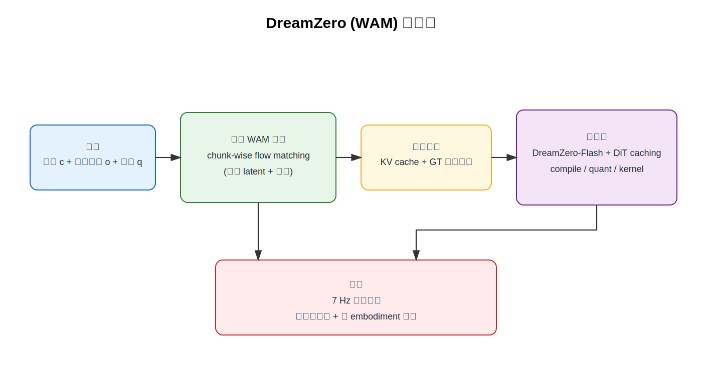

# 论文总结

## 基础信息
论文题目： World Action Models are Zero-shot Policies
作者： Seonghyeon Ye 等（NVIDIA 团队）
工作单位（optional)： NVIDIA
发表时间： 2026-02（arXiv: 2602.15922）
论文链接： https://arxiv.org/pdf/2602.15922

## 研究问题
### 要解决什么问题？
- 现有 VLA 在语义泛化上强，但在新环境中的新动作泛化较弱。
- 论文要验证：是否可以通过联合预测视频与动作（WAM）来获得更强的物理泛化、跨 embodiment 迁移和少样本适配。

### 问题的数学描述
- DreamZero 将联合预测分解为视频预测 + 逆动力学动作预测：
$$
\pi_\theta(o_{l:l+H}, a_{l:l+H}\mid o_{0:l}, c, q_l)
= \pi_\theta(o_{l:l+H}\mid o_{0:l}, c, q_l)
\cdot \pi_\theta(a_{l:l+H}\mid o_{0:l+H}, q_l)
$$
- 训练采用 joint flow matching。对第 $k$ 个 chunk：
$$
z_{t_k}^k=t_k z_1^k+(1-t_k)z_0^k,\quad a_{t_k}^k=t_k a_1^k+(1-t_k)a_0^k
$$
$$
\mathcal{L}(\theta)=\mathbb{E}\left[\frac{1}{K}\sum_{k=1}^K w(t_k)
\left\|u_\theta([z_{t_k}^k,a_{t_k}^k];\mathcal{C}_k,c,q_k,t_k)-v^k\right\|_2^2\right]
$$
其中 $v^k=[z_1^k,a_1^k]-[z_0^k,a_0^k]$。

### 研究内容的关键假设
- 预训练视频扩散模型蕴含可迁移的时空物理先验，可帮助动作学习。
- 用视频 future 约束动作（隐式 IDM）比直接 observation-to-action 映射更易泛化。
- 多样、非重复数据比高度重复演示更有利于 open-world 泛化。
- 推断：跨 embodiment 的纯视频监督可补充“世界动态”而不必依赖动作标注。

### 为什么重要？
- 如果成立，可降低机器人高质量动作标注依赖，并提升新任务/新环境/新机器人上的数据效率。
- 论文还给出 14B 视频扩散策略模型实机 7 Hz 闭环控制路径，回答了“WAM 是否可实时部署”的工程问题。

## 技术方法
### 整个技术框架和原理（如适用）
- 基于 Wan2.1-I2V-14B 视频扩散骨干，构建 14B DreamZero。
- 统一模型联合预测视频 latent 与动作（非两模型串联）。
- 自回归 chunk 训练与推断，使用 teacher forcing + KV cache。
- 通过 system + kernel + quantization + DreamZero-Flash 将延迟从约 5.7 s 降到 150 ms（GB200，表 1）。

### 流程图（必填）
流程图源文件： `./assets/2602.15922-dreamzero-wam-flow.drawio`

图注： 推断流程图。展示 DreamZero 的训练-推断-加速部署主流程。

### 系统架构图说明
- 主干：Joint Video-Action DiT（14B）。
- 条件输入：文本指令 $c$、视觉历史 $o_{0:l}$、本体状态 $q$。
- 轻量增量模块：state encoder、action encoder、action decoder（论文强调“最小新增参数”）。
- 训练时：当前 noisy chunk 可 attend 过去 clean context（attention mask 控制）。
- 闭环时：执行后用真实观测替换 cache 中生成帧，缓解纯自回归视频误差累积。

### 具体算法（针对每个具体神经网络）
- Joint DiT：预测视频与动作联合 velocity。
- DreamZero-Flash：训练时 decoupled noise schedule，视频采样 $t_{vid}\sim\mathrm{Beta}(7,1)$、动作采样 $t_{act}\sim\mathcal{U}(0,1)$，以适配少步去噪下“视频仍噪声较大”的推断条件。
- 推断算法：prefill KV cache 后，循环执行 chunk-level denoising 与动作输出；支持 DiT cache 复用。

### 每个神经网络的架构
- 论文明确给出：主体为 14B image-to-video diffusion backbone（Wan2.1-I2V-14B-480P）。
- 论文未在主文完整公开逐层宽度/头数等超参数；仅给出模块级结构与 attention 策略。
- N/A：各子模块精确层数与维度未在主文明确给出。

### 训练目的和 loss function
- 主目标：joint flow matching（式 (2)(3)）。
- 训练策略：shared timestep（DreamZero）与 decoupled timestep（DreamZero-Flash）两种。
- teacher forcing：当前 chunk 去噪，条件为过去 clean chunks。

### 如何获取训练数据
- AgiBot G1 预训练数据约 500 小时，7,193 episodes（平均 4.4 分钟、42.4 subtasks）。
- DROID 用于 Franka 实验。
- 跨 embodiment：YAM 机器人视频（20 分钟）与人类第一视角视频（12 分钟），仅用于视频预测目标（无动作标签）。
- 新 embodiment 少样本适配：YAM 约 30 分钟 play data（55 trajectories，11 tasks）。

### 训练算法实践中的 insights 和 tricks
- 自回归优于双向：动作更平滑，且因 KV cache 推断速度更快（文中称约 3-4 倍）。
- 数据多样性显著影响性能：14B AR 在 diverse 数据优于 repetitive 数据（50% vs 33%，表 4）。
- 模型尺度有效：14B 明显优于 5B（50% vs 21%，表 4）。
- 系统优化链路：CFG 并行、DiT caching、torch.compile + CUDA Graph、kernel/scheduler GPU 化、NVFP4 量化。

## 实验结果
### 实验环境是什么，如何构建？
- 机器人平台：AgiBot G1（双臂移动操作）、Franka（DROID）。
- 评测设定：默认 zero-shot 新环境 + 新物体；另有 unseen tasks、post-training tasks、跨 embodiment、few-shot 新机器人适配。
- 指标：task progress 与 success rate。

### 对比的 baseline 算法有哪些？
- GR00T N1.6（scratch / pretrained）。
- $\pi$0.5（scratch / pretrained）。
- 同时在 AgiBot 与 DROID-Franka 上对比。

### 重要结果总结
- Seen tasks（AgiBot）：DreamZero 平均 task progress 62.2%，最佳 pretrained VLA 为 27.4%（>2 倍）。
- Unseen tasks（AgiBot）：DreamZero 39.5%，pretrained VLA 16.3%；from-scratch VLA 近乎 0。
- Unseen tasks（DROID-Franka）：DreamZero 49% task progress、22.5% success rate，优于 GR00T N1.6（31%/12.5%）与 $\pi$0.5（33%/7.5%）。
- 跨 embodiment（仅视频 10-20 分钟）：38.3% 提升到 54.3%（Human2Robot）或 55.4%（Robot2Robot）。
- DreamZero-Flash：1 步去噪下 74%（vs 普通 1 步 52%，4 步 83%），并实现 150 ms 延迟；整体最高 38 倍加速。

## 总结
### 文章最主要的 idea 是什么？
- 把策略学习改写为“联合视频-动作世界建模”，利用视频扩散先验学习物理动态，再通过隐式 IDM 映射到动作，从而提升泛化与迁移。

### 最大的亮点是什么？
- 更强 zero-shot 泛化（多项任务 2 倍级优势）。
- 仅用少量跨 embodiment 视频即可提升 unseen task 表现。
- 14B 扩散策略达到可闭环实时控制（约 7 Hz）。

### 重要拓展方向？
- 更长时程上下文（当前约 6.6 秒）与 System-2 规划结合。
- 扩展到更大规模人类视频迁移。
- 降低计算成本并提升高精度操作（如插孔、精装配）。

### 其它 critiques
- 训练/部署成本仍高（14B + 多级优化 + 高端硬件）。
- 多项关键结果主要来自内部数据与系统栈，外部复现实操门槛高。
- 跨 embodiment 改善显著但绝对成功率仍有提升空间。
- 推断：当前性能瓶颈常来自视频生成误差，说明“世界模型质量”仍是动作质量上限。
