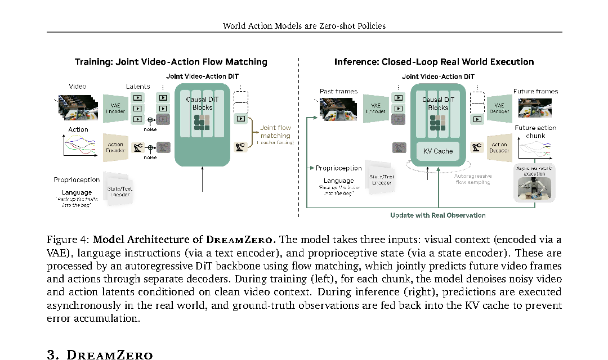

# 论文总结

## 基础信息
论文题目： World Action Models are Zero-shot Policies
作者： Seonghyeon Ye 等
工作单位（optional)： NVIDIA
发表时间： 2026-02-17（arXiv v1）
论文链接： https://arxiv.org/pdf/2602.15922

## 研究问题
### 要解决什么问题？
- 现有 Vision-Language-Action (VLA) 在语义泛化上表现好，但在新环境中的未见物理动作泛化较弱。
- 论文提出 World Action Model (WAM)：联合预测未来视频与动作，验证其是否能提升 zero-shot 泛化、跨 embodiment 迁移和少样本适配能力。

### 问题的数学描述
- DreamZero 的联合策略分解（论文式 (1)）：
$$
\pi_0(o_{l:l+H}, a_{l:l+H} \mid o_{0:l}, c, q_l)
= \pi_0(o_{l:l+H} \mid o_{0:l}, c, q_l)
\cdot \pi_0(a_{l:l+H} \mid o_{0:l+H}, q_l)
$$
- 训练时对第 $k$ 个 chunk 采用 joint flow matching（论文式 (2)(3)）：
$$
z_{t_k}^{k}=t_k z_1^{k} + (1-t_k) z_0^{k},\quad
a_{t_k}^{k}=t_k a_1^{k} + (1-t_k) a_0^{k}
$$
$$
\mathcal{L}(\theta)=\mathbb{E}_{z,a,\{t_k\}}\!\left[\frac{1}{K}\sum_{k=1}^{K} w(t_k)
\left\|u_\theta\!\left([z_{t_k}^{k},a_{t_k}^{k}];\mathcal{C}_k,c,q_k,t_k\right)-v^k\right\|_2^2\right]
$$
其中 $v^k=[z_1^k,a_1^k]-[z_0^k,a_0^k]$，$\mathcal{C}_k$ 为历史 clean context。

### 研究内容的关键假设
在哪些假设、限制条件下开展的研究。
- 视频扩散预训练骨干包含可迁移的物理动态先验。
- 通过“预测未来世界状态 + 动作”的联合建模，可比直接 observation-to-action 更好学习物理动作泛化。
- 跨 embodiment 视频可仅用视频目标（无动作）增强 world model 的动态理解。
- 训练和部署依赖大模型与系统优化；论文主结果基于 14B 模型与高性能 GPU。

### 为什么重要？
- 在真实机器人中，动作标注成本高，且重复演示覆盖有限。若可借助视频监督学习动作泛化，可显著提升数据效率与开放场景适应性。
- 论文报告相对 SOTA VLA 超过 2 倍泛化提升，并把 14B 视频扩散策略推进到 7 Hz 闭环控制。

## 技术方法
### 整个技术框架和原理（如适用）
- DreamZero 基于 Wan2.1-I2V-14B-480P 骨干，联合建模视频 latent 与动作。
- 训练：teacher-forcing 的 chunk-wise 去噪，当前 noisy chunk 条件于历史 clean chunks。
- 推断：自回归 chunk 生成，利用 KV cache；执行时异步闭环，并将真实观测回填历史上下文。
- 加速：system / implementation / model 三级优化，含 CFG 并行、DiT caching、torch.compile + CUDA Graph、kernel/scheduler 优化、NVFP4 量化与 DreamZero-Flash。

### 流程图（必填）
图示 1（优先论文原图）：
- 图片：`./assets/2602.15922-fig4-arch.png`
- 图注：论文原图，来源 Figure 4（Section 3.1, Model Architecture）。展示训练与推断两阶段、网络主干、输入输出与闭环回填。

图示 2（补充推断流程）：
- 图片：`./assets/2602.15922-dreamzero-wam-flow.svg`
- 若为 draw.io 自绘，源文件：`./assets/2602.15922-dreamzero-wam-flow.drawio`
- 图注：推断流程图。补充展示 DreamZero 的训练（联合 flow matching）- 推断（KV cache + 闭环）- 加速部署链路。

### 系统架构图说明
有几个神经网络，每个的输入输出、作用目的和信号更新频率。
- 1 个联合 DiT 主干（14B）：输入视觉历史、语言指令、本体状态与噪声条件；输出视频与动作的联合 velocity。
- 轻量新增模块：state encoder、action encoder、action decoder。
- 输入输出：
- 输入：$o_{0:l}$、$c$、$q_l$ 与当前 chunk 噪声变量。
- 输出：未来视频 latent 与动作序列（按 chunk 生成）。
- 更新频率（论文给出的时域设定）：每个 chunk 覆盖约 1.6 秒；最大上下文约 6.6 秒；部署达到约 7 Hz 闭环控制。

### 具体算法（针对每个具体神经网络）
- 联合去噪：模型在同一网络中同时预测视频与动作 velocity。
- DreamZero-Flash：将视频与动作的噪声时间步解耦；视频侧偏向高噪声采样（示例为 Beta(7,1)，期望 $E[t_{video}]=0.125$），动作侧保持均匀采样。
- 推断中可基于速度方向一致性复用缓存，减少重复计算。

### 每个神经网络的架构
几层、如何构造、输入输出是什么。
- 已明确：骨干为 Wan2.1-I2V-14B-480P（image-to-video diffusion transformer）。
- 已明确：训练会更新 DiT blocks + state/action 模块，冻结 text encoder、image encoder、VAE。
- N/A：主文未完整公开逐层层数、宽度、注意力头等全部细粒度结构（未在论文中明确给出）。

### 训练目的和 loss function
- 主损失：joint flow matching（见上式 (2)(3)）。
- DreamZero：视频与动作共享去噪时间步（训练早期更快收敛）。
- DreamZero-Flash：训练期采用视频/动作解耦时间步，改善少步去噪推断质量。

### 如何获取训练数据
- AgiBot G1 预训练数据约 500 小时，覆盖 22 个环境，约 7,193 个 episodes；平均 episode 时长约 4.4 分钟，平均约 42.4 个 subtasks。
- DROID 用于 Franka 单臂实验。
- 跨 embodiment 数据：YAM 机器人视频（20 分钟）与人类第一视角视频（12 分钟），用于视频目标（无动作）。
- 新 embodiment 适配：YAM 约 30 分钟 play data。

### 训练算法实践中的 insights 和 tricks
- AR 架构相比双向架构在推断更快（文中称约 3-4 倍）且动作更平滑。
- 数据多样性显著影响泛化：多样数据优于高重复数据（33% → 50%）。
- 模型规模有效：14B 明显优于 5B（50% vs 21%）。
- 端到端加速链路可实现累计最高 38 倍加速，并把延迟从 5.7 秒降到 150 ms（GB200）。

## 实验结果
### 实验环境是什么，如何构建？
- 平台：AgiBot G1（双臂移动操作）与 DROID-Franka（单臂）。
- 评测：seen tasks、unseen tasks、cross-embodiment transfer、few-shot 新 embodiment 适配。
- 指标：task progress、success rate；主文多处报告均值与标准误。

### 对比的 baseline 算法有哪些？
- GR00T N1.6（scratch / pretrained）。
- $\pi$0.5（scratch / pretrained）。
- 同时在 AgiBot G1 和 DROID-Franka 上对比。

### 重要结果总结
在哪些方面有明显优势。
- unseen tasks（AgiBot G1）：DreamZero 39.5%，显著高于 pretrained VLA 16.3%；from-scratch VLA 近 0。
- seen tasks（AgiBot G1）：DreamZero 平均 task progress 62.2%，高于最佳 pretrained VLA 27.4%。
- unseen tasks（DROID-Franka）：DreamZero 49% task progress / 22.5% success rate，优于 GR00T N1.6（31% / 12.5%）与 $\pi$0.5（33% / 7.5%）。
- 跨 embodiment：仅 10-20 分钟视频数据可将 unseen task progress 从 38.3% 提升到 54.3%（Human2Robot）或 55.4%（Robot2Robot）。
- DreamZero-Flash：1 步去噪下达到 74%（普通 DreamZero 1 步为 52%，4 步基线为 83%），并保持 150 ms 推断延迟。

## 总结
### 文章最主要的 idea 是什么？
- 将策略学习统一到“世界状态 + 动作”的联合生成问题中，用视频建模物理动态，再通过联合去噪得到可执行动作。

### 最大的亮点是什么？
- 在实机上同时实现了：
- 显著更强的 zero-shot 动作泛化。
- 视频-only 跨 embodiment 迁移（无需动作标签）。
- 14B 视频扩散策略的实时闭环控制（7 Hz）。

### 重要拓展方向？
- 扩展更长视觉上下文（主文指出当前约 6.6 秒）。
- 提升高精度接触任务的稳定性与成功率。
- 降低大模型实时部署的硬件与工程成本。

### 其它 critiques
- 训练与部署成本高，对硬件和系统工程能力要求高。
- 关键实验大量依赖内部数据与完整系统栈，外部复现实践门槛较高。
- 推断：当前性能上限仍受视频预测误差传播影响，世界模型精度仍是动作质量瓶颈之一。
